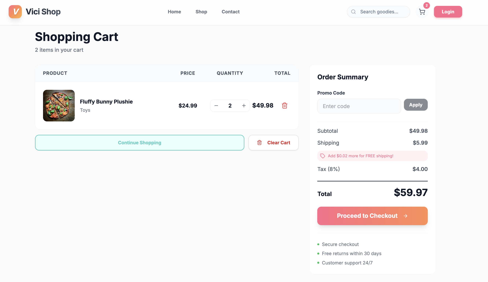

# Vici E-Commerce Platform

A production-ready, full-stack e-commerce platform built with modern microservices architecture, featuring real-time recommendations, event-driven design, and a responsive frontend.

## 📸 Platform Screenshots

### Home Page - Modern UI with Curated Collections


### Product Recommendations


### Shopping Cart


---

## 🎯 Overview

Vici is a complete e-commerce solution designed for scalability, performance, and maintainability. The platform uses microservices architecture with Docker containerization, enabling independent service deployment and scaling.

### ✨ Key Features Demonstrated Above

- 🎨 **Modern UI/UX** - Beautiful, responsive design with gradient backgrounds and floating animations
- 🛍️ **Product Management** - Browse, search, and filter products with real-time inventory
- 🛒 **Shopping Cart** - Persistent cart with Redis caching and coupon support
- 💳 **Payment Processing** - Secure payment integration (Stripe-ready)
- 🤖 **Product Recommendations** - Real-time personalized product recommendations using ML
- 📊 **Event Tracking** - User behavior analytics and tracking
- 🔐 **Authentication** - JWT-based secure authentication
- 📧 **Notifications** - Email and SMS notifications
- 📦 **Order Management** - Complete order lifecycle management
- 📱 **Responsive Design** - Works perfectly on desktop, tablet, and mobile devices

## 🏗️ Architecture

### Technology Stack

**Frontend:**
- React 19 + TypeScript
- Vite for fast builds
- TanStack Router
- Tailwind CSS + Shadcn UI
- Zustand for state management

**Backend:**
- **High-Performance Services**: Golang (Product, Inventory, Recommendation, Event)
- **Business Logic Services**: NestJS/TypeScript (Auth, User, Cart, Order, Payment, Notification)
- **Communication**: gRPC + Apache Kafka
- **Storage**: PostgreSQL + Redis + MinIO (S3-compatible)

### Microservices (10 Services)

| Service | Tech | Port | Description |
|---------|------|------|-------------|
| API Gateway | NestJS | 3000 | Request routing, authentication, rate limiting |
| Auth Service | NestJS | 3001 | User authentication, JWT token management |
| User Service | NestJS | 3002 | User profiles, addresses, preferences |
| Product Service | Golang | 3003 | Product catalog, search, filtering |
| Inventory Service | Golang | 3004 | Stock management, availability |
| Cart Service | NestJS | 3005 | Shopping cart operations |
| Order Service | NestJS | 3006 | Order processing and management |
| Payment Service | NestJS | 3007 | Payment gateway integration |
| Recommendation Service | Golang | 3008 | Real-time product recommendations |
| Event Service | NestJS | 3009 | User behavior tracking and analytics |
| Notification Service | NestJS | 3010 | Email/SMS notifications |

## 🚀 Quick Start

### Prerequisites

- Docker & Docker Compose
- Node.js 18+ (for frontend and TypeScript services)
- Go 1.21+ (for Golang services)
- Git

### 1. Clone Repository

```bash
git clone <repository-url>
cd ecomerce_rec
```

### 2. Environment Setup

```bash
# Copy environment template
cp backend/deployment/.env.example backend/deployment/.env

# Edit .env with your credentials
# Default credentials are already set for development
```

### 3. Start Infrastructure

```bash
cd backend/deployment
docker-compose up -d
```

This starts:
- PostgreSQL (database)
- Redis (cache)
- Kafka + Zookeeper (message broker)
- MinIO (file storage)
- Kafka UI (development tool)
- pgAdmin (database management)

### 4. Start Backend Services

```bash
# Install dependencies and start each service
# See backend/README.md for detailed instructions
```

### 5. Start Frontend

```bash
cd frontend
npm install
npm run dev
```

Visit `http://localhost:3000`

## 📁 Project Structure

```
ecomerce_rec/
├── frontend/                 # React frontend application
│   ├── src/
│   │   ├── components/      # Reusable UI components
│   │   ├── pages/          # Page components
│   │   ├── services/       # API clients
│   │   ├── stores/         # State management
│   │   └── hooks/          # Custom React hooks
│   └── docs/               # Frontend documentation
│
├── backend/
│   ├── services/           # Microservices
│   │   ├── api-gateway/   # NestJS - API Gateway
│   │   ├── auth-service/  # NestJS - Authentication
│   │   ├── user-service/  # NestJS - User management
│   │   ├── product-service/      # Golang - Products
│   │   ├── inventory-service/    # Golang - Inventory
│   │   ├── cart-service/  # NestJS - Shopping cart
│   │   ├── order-service/ # NestJS - Orders
│   │   ├── payment-service/      # NestJS - Payments
│   │   ├── recommendation-service/ # Golang - Recommendations
│   │   └── notification-service/ # NestJS - Notifications
│   │
│   ├── deployment/         # Docker infrastructure
│   │   ├── docker-compose.yml
│   │   ├── .env           # Environment variables
│   │   └── init-scripts/  # Database initialization
│   │
│   ├── proto/             # gRPC protocol definitions
│   └── docs/              # Backend documentation
│
└── docs/                  # General documentation
```

## 🔧 Infrastructure

### Docker Services

All infrastructure services are managed via Docker Compose with the "vici" naming convention:

- **vici-postgres** - PostgreSQL 15 (port 5432)
- **vici-redis** - Redis 7 (port 6379)
- **vici-kafka** - Apache Kafka (ports 9092, 9093)
- **vici-zookeeper** - Zookeeper for Kafka (port 2181)
- **vici-kafka-ui** - Kafka UI (port 8080)
- **vici-minio** - MinIO S3 storage (ports 9000, 9001)
- **vici-pgadmin** - pgAdmin (port 5050)

### Environment Variables

All sensitive credentials are stored in `backend/deployment/.env`:

- PostgreSQL credentials
- Redis password
- Kafka configuration
- MinIO access keys
- pgAdmin credentials

**⚠️ Never commit `.env` to version control!**

## 📊 Database Architecture

Each microservice has its own isolated database:
- `auth_db` - Authentication data
- `user_db` - User profiles
- `product_db` - Product catalog
- `inventory_db` - Stock information
- `cart_db` - Shopping carts
- `order_db` - Orders
- `payment_db` - Transactions
- `event_db` - User events
- `notification_db` - Notification logs

## 🔐 Security

- Environment-based configuration (no hardcoded secrets)
- JWT authentication
- Password hashing
- CORS protection
- Rate limiting
- Database isolation per service

## 📖 Documentation

- **Frontend**: [frontend/README.md](frontend/README.md)
- **Backend**: [backend/README.md](backend/README.md)
- **Architecture Diagrams**: [backend/docs/ARCHITECTURE_DIAGRAMS.md](backend/docs/ARCHITECTURE_DIAGRAMS.md)
- **System Architecture**: [docs/system-architecture.md](docs/system-architecture.md)

## 🛠️ Development

### Frontend Development

```bash
cd frontend
npm run dev          # Development server
npm run build        # Production build
npm run lint         # Linting
```

### Backend Development

Each service can be developed independently. See service-specific README files for details.

### Database Management

Access pgAdmin at `http://localhost:5050`
- Email: (from `.env`)
- Password: (from `.env`)

### Message Queue Monitoring

Access Kafka UI at `http://localhost:8080`

## 🧪 Testing

```bash
# Frontend tests
cd frontend
npm run test

# Backend service tests
cd backend/services/<service-name>
npm run test  # NestJS services
go test ./... # Golang services
```